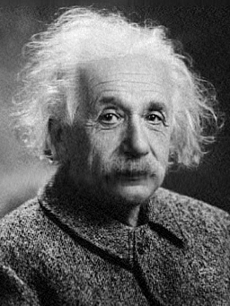
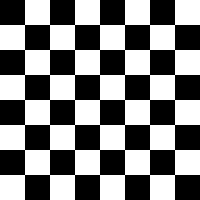
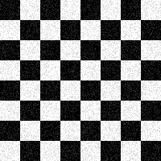
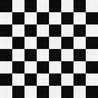
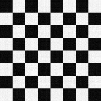
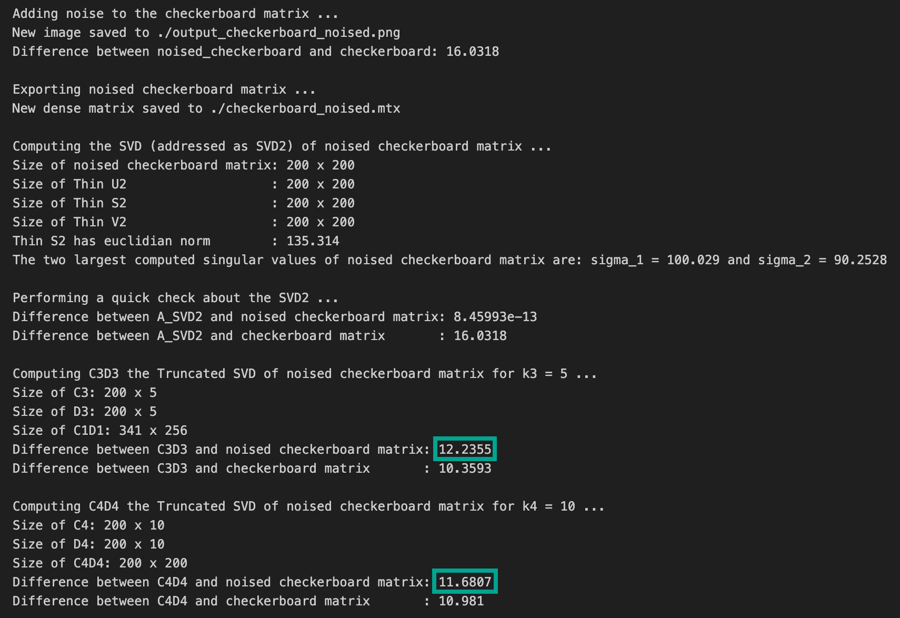
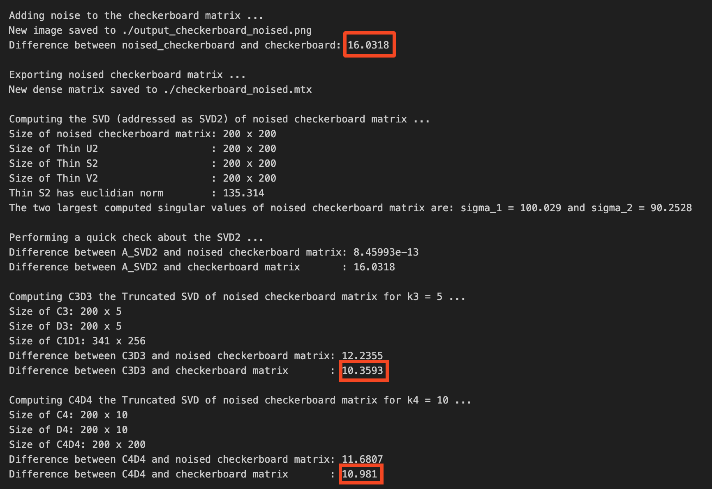

# NLA Challenge 2 (Group 6)

Hands-on Challenge 2 of the course _Numerical Linear Algebra_ by Professor Antonietti, Polimi, a.y. 2024/25.

The description of the challenge is [here](Challenge2_description.pdf). We really thank the teachers for the opportunity.

## 1. Execution Results

- To run the main code `Challenge2.cpp` on terminal using the Eigen library:

  ```bash
  g++ -I ${mkEigenInc} Challenge2.cpp -o exec
  ./exec einstein.jpg > output.txt
  ```

- To solve the eigenvalue problem $A^TA \mathbf{x}=\lambda \mathbf{x}$ on terminal using the power method available on Lis (Library of Iterative Solvers for linear systems):

  ```bash
  mpicc -DUSE_MPI -I${mkLisInc} -L${mkLisLib} -llis etest1.c -o eigen1
  mpirun -n 4 ./eigen1 Ata.mtx eigvec1.mtm hist1.txt -e pi -emaxiter 100 -etol 1.e-8 > output_Lis_1.txt
  ```

  The rate of convergence is $r=\dfrac{\left| \lambda_2 \right|}{\left| \lambda_1 \right|}$, where $\left| \lambda_1 \right|> \left| \lambda_2 \right|> \dots > \left| \lambda_{256} \right|$ are the eigenvalues of $A^TA$. In this particular case, we have:
  $$
  r=\frac{\left| \lambda_2 \right|}{\left| \lambda_1 \right|}=\frac{1394.69}{16083.3}=0.0867163\qquad \leadsto \qquad 8\text{ iterations}
  $$

  To accelerate the convergence you could apply a shift $\mu$ to the system. The new eigenproblem is $\left(A^TA-\mu I_d \right)\mathbf{x}=\lambda \mathbf{x}$, and with $\mu=695$ we get the following rate of convegence:
  $$
  r_\mu=\frac{\left| \lambda_2-\mu \right|}{\left| \lambda_1-\mu \right|}=\frac{1394.69-695}{16083.3-695}=0.0454687\qquad \leadsto \qquad 7\text{ iterations}
  $$

  The command is:

  ```bash
  mpirun -n 4 ./eigen1 Ata.mtx eigvec2.mtm hist2.txt -e pi -emaxiter 100 -etol 1.e-8 -shift 695 > output_Lis_2.txt
  ```

  In addiction, you can speed up the convergence thanks to the inverse power method with shift. This implies to applying the power method with matrix $\left(A^TA-\mu_2 I_d \right)^{-1}$. Since the eigenvalues of the previous matrix are the inverse of the eigenvalues of $\left(A^TA-\mu_2 I_d \right)$, then the rate of convergence for a shift $\mu_2=16083$ in this case is:
  $$
  r_{\mu_2}=\frac{\left| \lambda_1-\mu_2 \right|}{\left| \lambda_2-\mu_2 \right|}=\frac{16083.3-16083}{\left|1394.69-16083\right|}=2.15017\cdot 10^{-5}\qquad \leadsto \qquad 3\text{ iterations}
  $$

  The command is:

  ```bash
  mpirun -n 4 ./eigen1 Ata.mtx eigvec3.mtm hist3.txt -e ii -emaxiter 100 -etol 1.e-8 -shift 16083 > output_Lis_3.txt
  ```

---

### 2. Output Results

The detailed output results are shown in files below:

- For the `Challenge2.cpp` output: **[output.txt](output.txt)**

- For the Lis commands outputs: **[output_Lis_1.txt](output_Lis_1.txt)**, **[output_Lis_2.txt](output_Lis_2.txt)**  and **[output_Lis_3.txt](output_Lis_3.txt)**

---

### 3. Image Results

| Einstein                  | C1D1                     | C2D2                     |
| ------------------------- | ------------------------ | ------------------------ |
|  |  |  |

| Checkerboard                             | Noised Checkerboard                                    | C3D3                     | C4D4                     |
| ---------------------------------------- | ------------------------------------------------------ | ------------------------ | ------------------------ |
|  |  |  |  |

---

### 4. Final Comment

The compresed image `C4D4` for $k=10$ approximates better the noised checkerboard than the compressed `C3D3` for $k=5$, as one would expect from a SVD decomposition: as $k$ grows, the compressed image becomes similar to the noised one. 



Moreover, by comparing the compressed images to the original checkerboard we noticed that for $k=5$ the image is approximating the original matrix better than for $k=10$ and better than the noised matrix:



This is because with the truncated SVD you are selecting the "main features" of the original image (because you are selecting the leading singular values) and therefore you are actually deleting the background noise.
